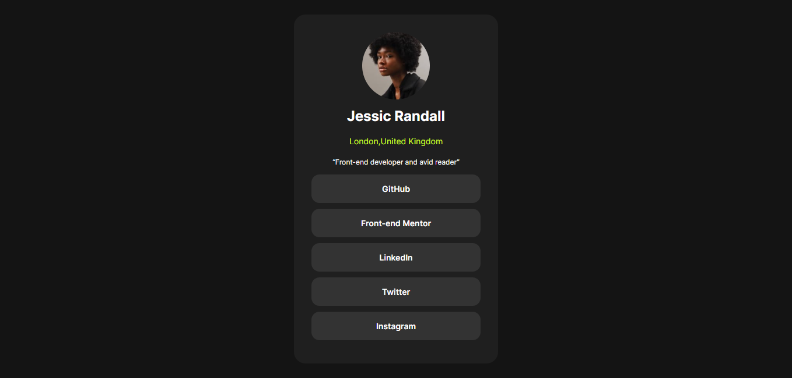
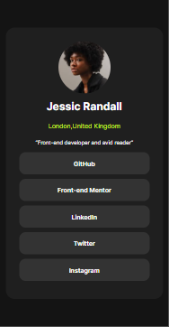

# Frontend Mentor - Social links profile solution

This is a solution to the [Social links profile challenge on Frontend Mentor](https://www.frontendmentor.io/challenges/social-links-profile-UG32l9m6dQ). Frontend Mentor challenges help you improve your coding skills by building realistic projects. 

## Table of contents

- [Overview](#overview)
  - [The challenge](#the-challenge)
  - [Screenshot](#screenshot)
  - [Links](#links)
  - [Built with](#built-with)
  - [What I learned](#what-i-learned)
- [Author](#author)
- [Acknowledgments](#acknowledgments)

## Overview

### The challenge

Users should be able to:

- See hover and focus states for all interactive elements on the page

### Screenshot

### Links

- Solution URL: [GitHub Repo](https://github.com/Chantal-Yvonne/Social-links-profile.git)
- Live Site URL: [Live demo](https://chantal-yvonne.github.io/Social-links-profile/)

### Built with

- Semantic HTML5 markup
- CSS custom properties
- Flexbox

### What I learned
-through this project ,I've improved my understanding on how to properly style interactive elemnts like buttons and links using CSS.I've learned that styling the parent element(<li>) does not always affect the child(<a>).I had to turn inline elements into block-level elements in order for it to fill the full width of its container.

## Author

- Frontend Mentor - [@Chantal-Yvonne](https://www.frontendmentor.io/profile/Chantal-Yvonne)

## Acknowledgments

This project was built based on a design brief provided by [Frontend Mentor](https://www.frontendmentor.io/).
Thanks to the Frontend Mentor community for creating helpful challenges that support practical learning and real-world development skills